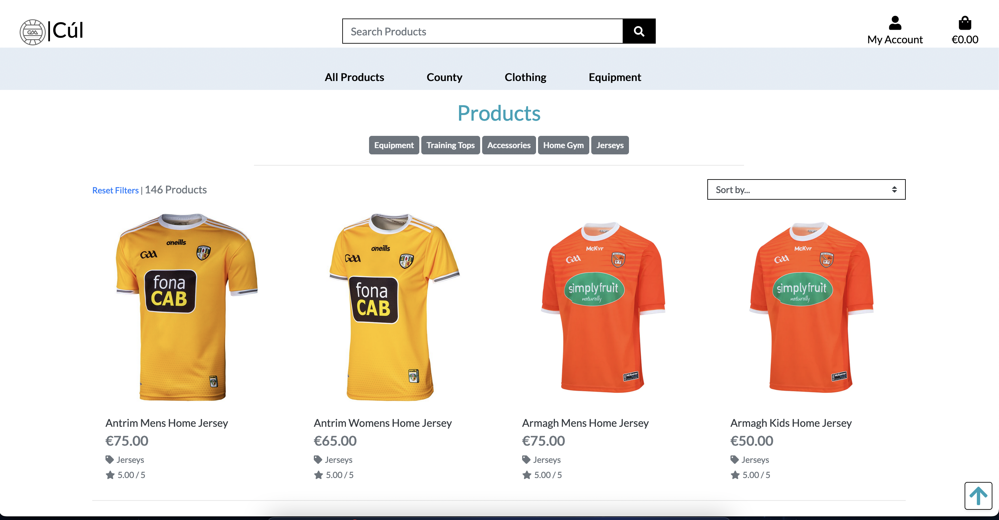
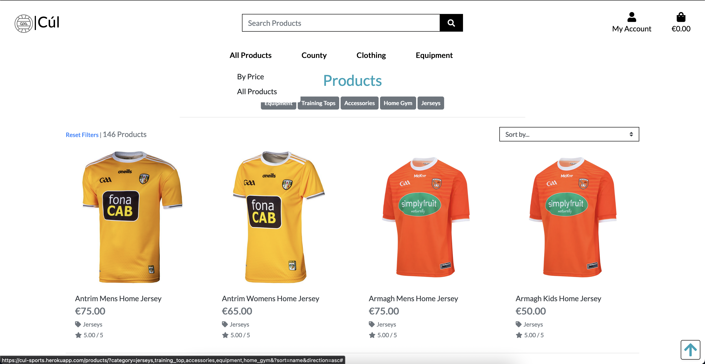
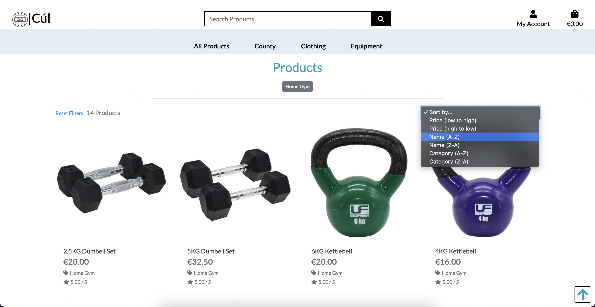
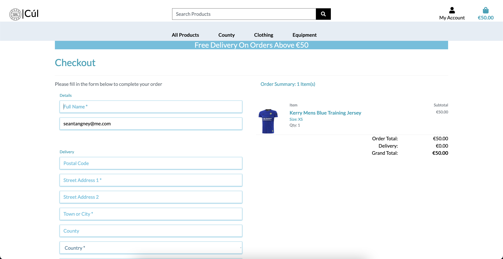
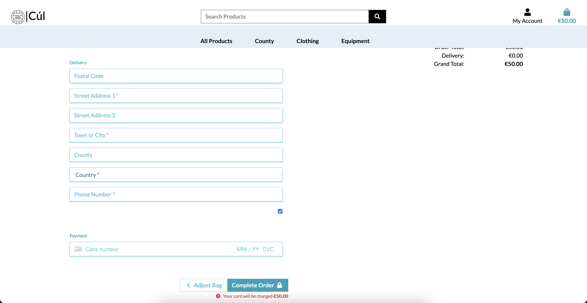
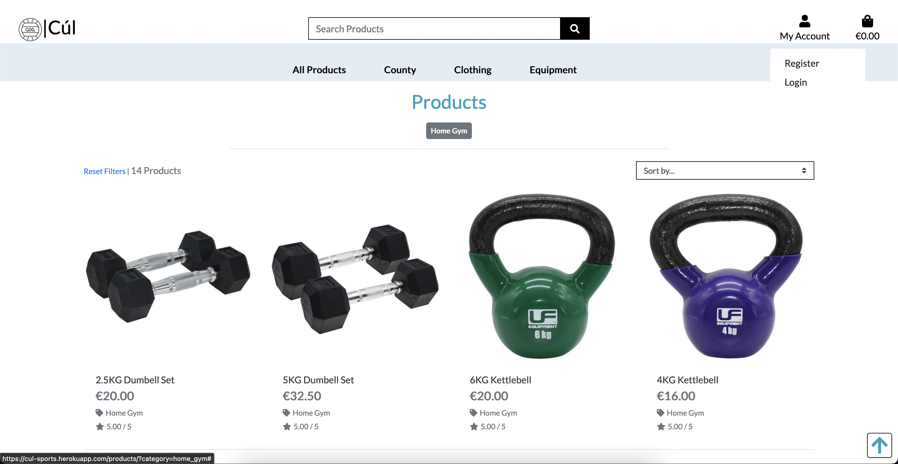
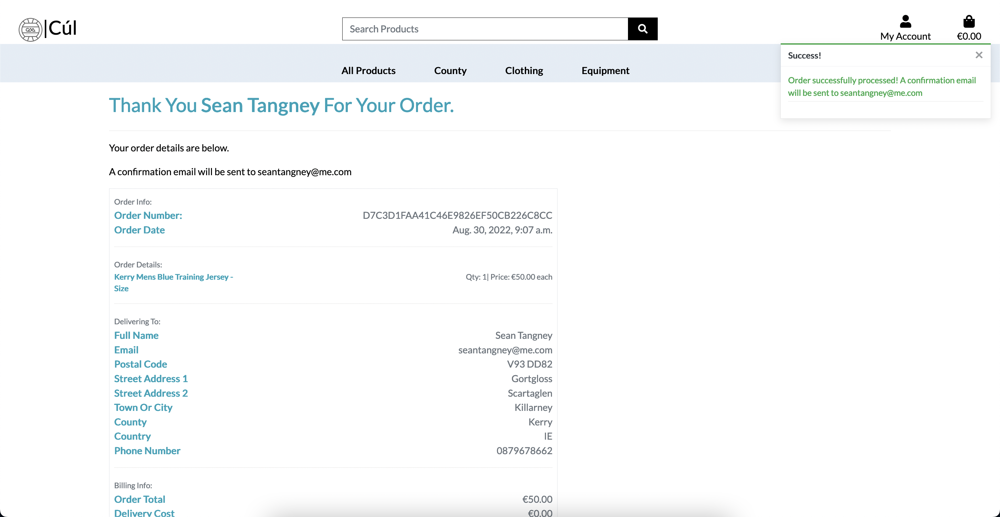
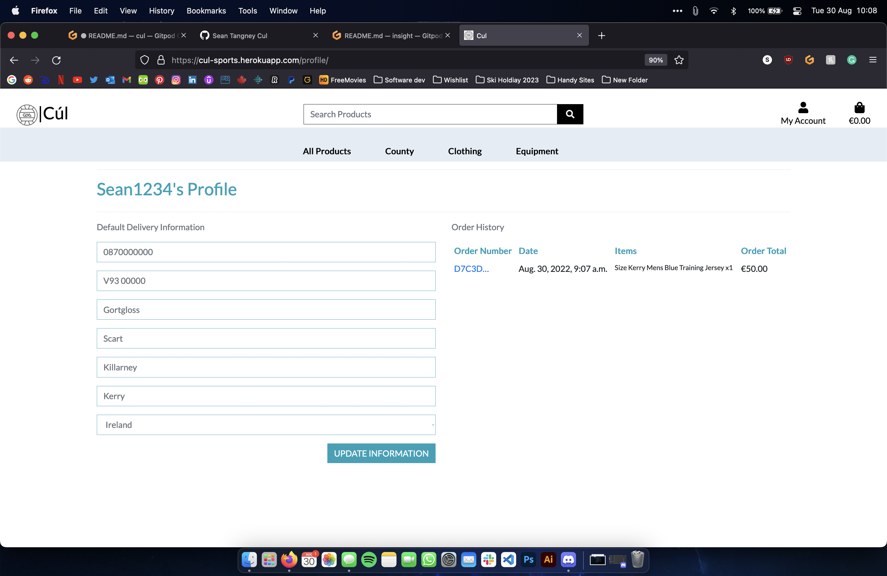

<h1 align="center">Cúl Sports</h1>

<h3 align="center">Online store for all your GAA sports needs</h3>
 
 

 

#   [Deployed Site](https://cul-sports.herokuapp.com/)

## User Experience (UX)
 

-   ## User Stories
    -   #### Viewing and Navigation  

        1. As a Shopper, I want to be able to view a range of products so i can select some to purchase.
        2. As a Shopper, I want to be able to view individual product details, so that i can Identify the price, description, product rating, product image and available sizes.
        3. As a Shopper, I want to be able to Easily view the total of my purchases at any time, so that i can avoid spending too much.
        

    -   #### Registration and User Accounts

        1. As a Site User, I want to be able to easily register for an account, so that i can have a personal account and be able to store my details.
        2. As a Site User, I want to be able to see my order history and save my delivery information in my profile.
        3. As a Site User, I want to be able to easily login or logout, so that i can Access my personal account information..
        4. As a Site User, I want to be able to reset my password if i forget it.
        5. As a Site User, I want to be able to Receive confirmation email after registration , so that i can Verify that my account registration was successful.

    -   #### Returning Visitor Goals

        1. As a Returning Visitor, I want to be able to Sort the list of available products , so that i can Easily sort by rating, price and categories.
        2. As a Returning Visitor, I want to be able to Sort a specific category product , so that i can Sort by best price, rating, category or sort the products in that category by name.
        3. As a Returning Visitor, I want to be able to Sort multiple categories of products simultaneously , so that i can Find best priced/rated products across broad categories such as clothing/homeware.
        4. As a Returning Visitor, I want to be able to Search for a product by name or description , so that i can Find a specific product I'd like to purchase.

    -   #### Site Maintainer / Admin Goals

        1. As an Admin of the site i want to be able to see new users and their account status.
        2. As an Admin of the site i want to be able to see new orders.
        3. As an admin of the site i want to be able to maintain the library of products, adding,deleting and editing them etc.

<h2>Wireframes</h2>

    
Click here to see wireframes.

     

    
Homepage

    

    
Sign Up

    

    
Sign In

    

    
Verify Email

    

    
Products Page

    

    
Product Detail

    

    
Checkout

    

    
Order Confirmation

    

## Design

- The Site logo was taken from [Shutterstock](https://www.shutterstock.com/image-vector/gaelic-football-square-line-vector-icon-1998494597) and i changed it a little in photoshop. I also used this image as my favicon.

- Homepage background image was taken from [Gaa.ie](https://www.gaa.ie/news/weekend-fixtures-guide-125479/)

- Colours used were greys and mainly bootstrap-info (#5bc0de). I really like the contrast of the plain white background across most of the site with the very colourful products on show.

## Features

On first entry of the site, a user will see the nice backgorund of Croke Park Stadium and will be prompted to view current Senior Jerseys.

    
Homepage

    

In the products page, a user has the option of navigating from the dropdown menu, the category indicators and they can also sort the products any way the choose.

    
Product Page

    
    
    
    

A user can click on a product to see a description and add it to the cart.

    
Product Detail Page

    
    

A user can go to the checkout and review what they are about to purchase if they have anything in the bag. Here they can fill in the form with their delivery details, and payment info and go through with their order.

    
Checkout Page

    
    

While its possible for users to checkout without being registered, frequent users can make an account and see their order history and store their delivery details.

    
Checkout Page

    
    
    
    
    

In the user profile, users can see their recent order history. They can also edit their saved user details.

    
User Profile

    

