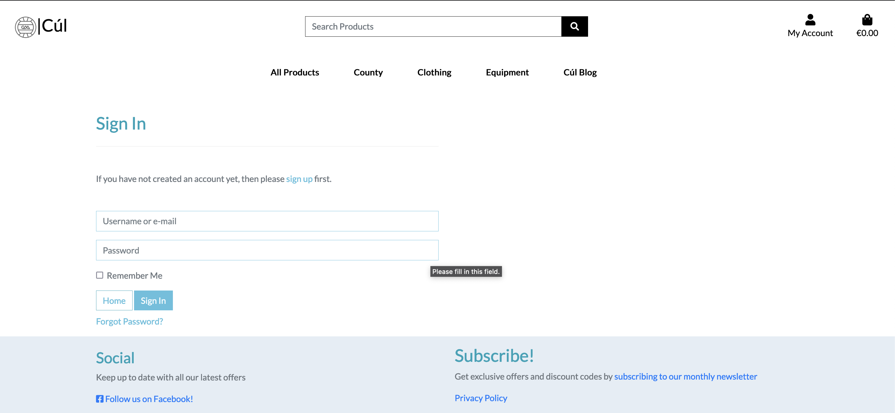

<h1 align="center">Cúl Sports</h1>

<h3 align="center">Online store for all your GAA sports needs</h3>
 
 

 

#   [Deployed Site](https://cul-sports.herokuapp.com/)

## Summary

Cúl is a website that sells GAA products. From football/hurling jersies from all 32 counties in Ireland to gaa accessories. Available products also include home gym equipment for training in the off season!

 

## Target Audience

The target audience for the website is current GAA players and fans of football and hurling who want to support their counties.

 

## User Experience (UX)
 

-   ## User Stories
    -   #### Viewing and Navigation  

        1. As a Shopper, I want to be able to view a range of products so i can select some to purchase.
        2. As a Shopper, I want to be able to view individual product details, so that i can Identify the price, description, product rating, product image and available sizes.
        3. As a Shopper, I want to be able to Easily view the total of my purchases at any time, so that i can avoid spending too much.
        

    -   #### Registration and User Accounts

        1. As a Site User, I want to be able to easily register for an account, so that i can have a personal account and be able to store my details.
        2. As a Site User, I want to be able to see my order history and save my delivery information in my profile.
        3. As a Site User, I want to be able to easily login or logout, so that i can Access my personal account information..
        4. As a Site User, I want to be able to reset my password if i forget it.
        5. As a Site User, I want to be able to Receive confirmation email after registration , so that i can Verify that my account registration was successful.

    -   #### Returning Visitor Goals

        1. As a Returning Visitor, I want to be able to Sort the list of available products , so that i can Easily sort by rating, price and categories.
        2. As a Returning Visitor, I want to be able to Sort a specific category product , so that i can Sort by best price, rating, category or sort the products in that category by name.
        3. As a Returning Visitor, I want to be able to Sort multiple categories of products simultaneously , so that i can Find best priced/rated products across broad categories such as clothing/equipment.
        4. As a Returning Visitor, I want to be able to Search for a product by name or description , so that i can Find a specific product I'd like to purchase.

    -   #### Site Maintainer / Admin Goals

        1. As an Admin of the site i want to be able to see new users and their account status.
        2. As an Admin of the site i want to be able to see new orders.
        3. As an admin of the site i want to be able to maintain the library of products, adding,deleting and editing them etc.

<h2>Wireframes</h2>

    
Click here to see wireframes.

     

    
Homepage

    

    
Sign Up

    

    
Sign In

    

    
Verify Email

    

    
Products Page

    

    
Product Detail

    

    
Checkout

    

    
Order Confirmation

    

## Design

- The Site logo was taken from [Shutterstock](https://www.shutterstock.com/image-vector/gaelic-football-square-line-vector-icon-1998494597) and i changed it a little in photoshop. I also used this image as my favicon.

- Homepage background image was taken from [Gaa.ie](https://www.gaa.ie/news/weekend-fixtures-guide-125479/)

- Colours used were greys and mainly bootstrap-info (#5bc0de). I really like the contrast of the plain white background across most of the site with the very colourful products on show.

## Features

On first entry of the site, a user will see the nice backgorund of Croke Park Stadium and will be prompted to view current Senior Jerseys.

    
Homepage

    

In the products page, a user has the option of navigating from the dropdown menu, the category indicators and they can also sort the products any way the choose.

    
Product Page

    
    
    
    

A user can click on a product to see a description and add it to the cart.

    
Product Detail Page

    
    

A user can go to the checkout and review what they are about to purchase if they have anything in the bag. Here they can fill in the form with their delivery details, and payment info and go through with their order.

    
Checkout Page

    
    

While its possible for users to checkout without being registered, frequent users can make an account and see their order history and store their delivery details.

    
Checkout Page

    
    
    
    
    

In the user profile, users can see their recent order history. They can also edit their saved user details.

    
User Profile

    

 
 

# Testing User Stories from UX Section

-   ## Viewing and Navigation  

    1. As a Shopper, I want to be able to view a range of products so i can select some to purchase.

        - It is clear to me as a user how to navigate the website and how to view products.
        - On the landing page i can clearly see a navigation bar and i am also prompted to view this years senior jerseys.
        

    2. As a Shopper, I want to be able to view individual product details, so that i can identify the price, description, product rating, product image and available sizes.

        - In any of the product pages, the preview has a price, rating and image of the product. If i click on any product it brings me to a product detail page where i can see details of the product, select sizes and add it to the shopping bag if i wish.
        - It is clear that all of the clothing products are available with sizes and the equipment products are not.

    3. As a Shopper, I want to be able to Easily view the total of my purchases at any time, so that i can avoid spending too much.

        - It is clear that all of the products on the site are presented with their price. 
        - At any given time if there are products in the checkout bag, then there is a grand total desplayed on the checkout icon (top right).
        - On the checkout page i can clearly see a subtotal of any product if the quantity is more than one. I can see a delivery cost and i can see a grand total.

 

-   ## Registration and User Accounts

    1. As a Site User, I want to be able to easily register for an account, so that i can have a personal account and be able to store my details.

        - When i click the user icon on the top right of the screen i can clearly see where to register for an account or sign in if i already have one.
        - When i register i get an email sent to verify my account.

    2. As a Site User, I want to be able to see my order history and save my delivery information in my profile.

        - When i am a registered user i gain access to a user profile. Here i can update my delivery information to ensure swift checkouts. 
        - I can see my past order history in my user profile.

    3. As a Site User, I want to be able to easily login or logout, so that i can Access my personal account information.
        
        - Logging in and out is very user friendly and can be found by pressing on the user icon in the top right of the screen.

    4. As a Site User, I want to be able to reset my password if i forget it.

        - Resetting a password is easy and can be accessed from the sign in page. 

    5. As a Site User, I want to be able to receive confirmation email after registration , so that i can Verify that my account registration was successful.

        - An email will be sent to new users upon registration to verify their account.

 

-   ## Returning Visitor Goals

    1. As a Returning Visitor, I want to be able to Sort the list of available products , so that i can easily sort by rating, price and categories.

        - On the products page i can click the "sort by" dropdown menu and choose how to to order the products im viewing.

    2. As a Returning Visitor, I want to be able to sort a specific category product , so that i can Sort by best price, rating, category or sort the products in that category by name.

        - From the navbar i can select from the dropdown menus which category of item i want to look at. I can also see category indicators below the navbar which i can press to change to more specific categories.

    3. As a Returning Visitor, I want to be able to Sort multiple categories of products simultaneously , so that i can Find best priced/rated products across broad categories such as clothing/equipment.

        - By navigating to the all products page. I can click on the category indicators below the nav bar to show only categories that i want to.

    4. As a Returning Visitor, I want to be able to Search for a product by name or description , so that i can Find a specific product I'd like to purchase.

        - By using the search bar i can type any product name or related word into the search bar and see relevant products.

 

-   ## Site Maintainer / Admin Goals

    1. As an Admin of the site i want to be able to see new users and their account status.

        - Using the django admin page, as a superuser / admin i can login and view current users and their account status. I can also change the status of an account.

    2. As an Admin of the site i want to be able to see new orders.

        - Using the django admin page, as a superuser / admin i can view successful orders.
    
    3. As an admin of the site i want to be able to maintain the library of products -  adding , deleting and editing them etc.

        - As an admin/superuser, i have extra options from the user icon in the top right of the screen. I can navigate to an add products page. I can also add products from the django admin panel.
        
        - Additonally i have extra options on the product detail page where i can edit / delete a product from the database straight from there.
    

-   # Testing

    -  I tested the website on Google Chrome, Internet Explore, Firefox, Safari and Edge.
    -  I tested to make sure the website links and navigation are working correctly.
    -  The website was tested on iPhone 8, X and 11 pro, iPad, Macbook, and Desktop by Me.
    -  I asked friends to critique the site and make an account/purchases to ensure it was working from their device and to ensure it was a user friendly experience for them.

# Frameworks, Libraries & Programs Used

1. [Bootstrap](https://getbootstrap.com/docs/4.4/getting-started/introduction/)
    - Bootstrap was used to assist with the responsiveness and styling of the website.

2. [Hover.css](https://ianlunn.github.io/Hover/)
    - Hover.css is used give on the nav bar and on the homepage shop now button.

3. [Google Fonts](https://fonts.google.com/)
    - Google Fonts was used to import and make use of the "Lato" font into the style.css file which is used throughout the project.

4. [Font Awesome](https://fontawesome.com/)
    - Font Awesome was used for icons in the header and on buttons.

5. [Git](https://git-scm.com/)
    - Git was used for version control by utilizing the Gitpod terminal to commit to Git and Push to Github.

6. [GitHub](https://github.com/)
    - GitHub is used to store the projects code after being pushed from Git. It was also used to make a kanban board for the project issues.

7. [Photoshop](https://www.adobe.com/ie/products/photoshop.html)
    - Photoshop was used for resizing logos, images and editing for the website.

8. [Balsamiq](https://balsamiq.com/)
    - Balsamiq was used to create all of the wireframes during the design process.

9. [AWS](https://aws.amazon.com/)
    - Aws was used to store the static files for the website.

10. [Heroku](https://www.heroku.com)
    - Heroku was used to host the website.

11. [Django](https://www.djangoproject.com/)
    - Django was used to give the site a clean and pragmatic design.

12. [Django|Crispy Forms](https://django-crispy-forms.readthedocs.io/en/latest/)
    - Django crispy forms was used to render elegant forms on the website.

