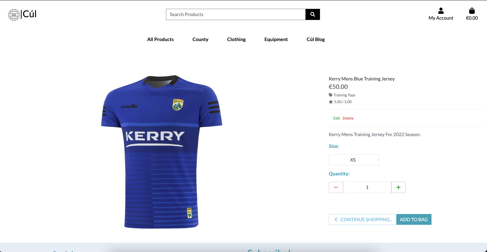
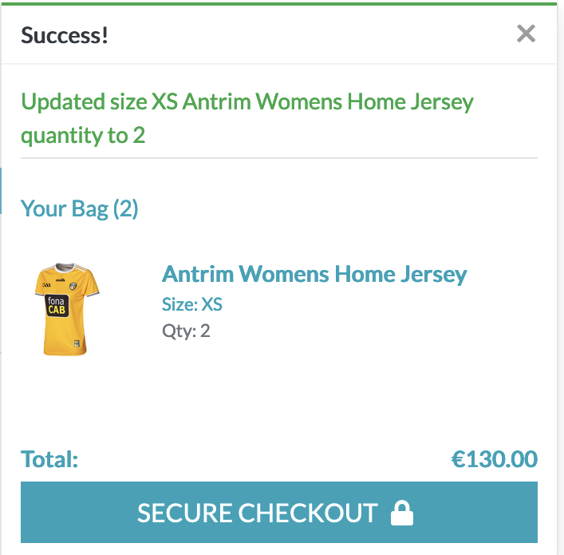
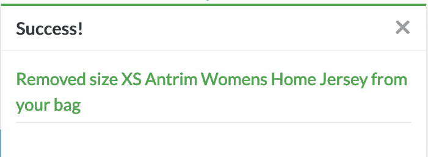

<h1 align="center">Cúl Sports</h1>

<h3 align="center">Online store for all your GAA sports needs</h3>
 
 

 

#   [Deployed Site](https://cul-sports.herokuapp.com/)

## Summary

Cúl is a website that sells GAA products. From football/hurling jersies from all 32 counties in Ireland to gaa accessories. Available products also include home gym equipment for training in the off season!

 

## Target Audience

The target audience for the website is current GAA players and fans of football and hurling who want to support their counties.

In Ireland there are 32 counties and every county has a football and hurling team. A lot of people own their native county jerseys and most people play football or hurling at some point in their life.

 

## User Experience (UX)
 

-   ## User Stories
    -   #### Viewing and Navigation  

        1. As a Shopper, I want to be able to view a range of products so i can select some to purchase.
        2. As a Shopper, I want to be able to view individual product details, so that i can Identify the price, description, product rating, product image and available sizes.
        3. As a Shopper, I want to be able to Easily view the total of my purchases at any time, so that i can avoid spending too much.
        

    -   #### Registration and User Accounts

        1. As a Site User, I want to be able to easily register for an account, so that i can have a personal account and be able to store my details.
        2. As a Site User, I want to be able to see my order history and save my delivery information in my profile.
        3. As a Site User, I want to be able to easily login or logout, so that i can Access my personal account information..
        4. As a Site User, I want to be able to reset my password if i forget it.
        5. As a Site User, I want to be able to Receive confirmation email after registration , so that i can Verify that my account registration was successful.
        6. As a site user, I want to see and read relevant blog posts so i can learn more about the Gaa.

    -   #### Returning Visitor Goals

        1. As a Returning Visitor, I want to be able to Sort the list of available products , so that i can Easily sort by rating, price and categories.
        2. As a Returning Visitor, I want to be able to Sort a specific category product , so that i can Sort by best price, rating, category or sort the products in that category by name.
        3. As a Returning Visitor, I want to be able to Sort multiple categories of products simultaneously , so that i can Find best priced/rated products across broad categories such as clothing/equipment.
        4. As a Returning Visitor, I want to be able to Search for a product by name or description , so that i can Find a specific product I'd like to purchase.

    -   #### Site Maintainer / Admin Goals

        1. As an Admin of the site i want to be able to see new users and their account status.
        2. As an Admin of the site i want to be able to see new orders.
        3. As an admin of the site i want to be able to maintain the library of products, adding,deleting and editing them etc.
        4. As an admin, I want to be able to make blog posts so that i can advertise products to the user through them.

<h2>Wireframes</h2>

    
Click here to see wireframes.

     

    
Homepage

    

    
Sign Up

    

    
Sign In

    

    
Verify Email

    

    
Products Page

    

    
Product Detail

    

    
Checkout

    

    
Order Confirmation

    

    
Blog

    

    
Blog Details

    

## Design

- The Site logo was taken from [Shutterstock](https://www.shutterstock.com/image-vector/gaelic-football-square-line-vector-icon-1998494597) and i changed it a little in photoshop. I also used this image as my favicon.

- Homepage background image was taken from [Gaa.ie](https://www.gaa.ie/news/weekend-fixtures-guide-125479/)

- Colours used were greys and mainly bootstrap-info (#5bc0de). I really like the contrast of the plain white background across most of the site with the very colourful products on show.

# User Features

On first entry of the site, a user will see the nice backgorund of Croke Park Stadium and will be prompted to view current Senior Jerseys. They will also get a model popup asking if they would like to join the mailing list.

    
Homepage

    
    

At the bottom of the website there is a footer. It contains a link to the Cúl Sports Facebook page, a link to sign up to the newsletter and also the websites privacy policy.

    
Footer

    

In the products page, a user has the option of navigating from the dropdown menu, the category indicators and they can also sort the products any way they choose.

    
Product Page

    
    
    
    

A user can click on a product to see a description and add it to the cart.

    
Product Detail Page

    
    

A user can go to the checkout and review what they are about to purchase if they have anything in the bag. Here they can fill in the form with their delivery details, and payment info and go through with their order.

    
Checkout Page

    
    

While its possible for users to checkout without being registered, frequent users can make an account and see their order history and store their delivery details.

    
Checkout Page

    
    

In the user profile, users can see their recent order history. They can also edit their saved user details.

    
User Profile

    

Users can use the nav menu to go to the Cúl Blog. Here they can find relevant Gaa articles. Within these articles will be links back to the store where they can purchase relevant jerseys.

    
Blog

    
    

Cúl Sports Facebook page mock up. I used the supplied wireframe.

    
Facebook

    

# Admin Features

Admin and superusers get access to the Django Admin panel. Here they can update products, blogposts, review orders and check user's status.

    
Admin Panel

    

An Admin/Superuser for the website can access a product management page. Here they can add a product straight from the website without having to use the Django Admin panel. They also get access to the edit/delete buttons on the product detail page.

    
Admin - Products

    
    
    

An Admin/SuperUser can access the Add Blogpost Page. They also get access the edit blog post and delete blogpost features on the blog detail page. There is a Rich Text Editor installed to allow for better styling when adding blog posts.

    
Blog

    
    
    

 
 

# Testing User Stories from UX Section

-   ## Viewing and Navigation  

    1. As a Shopper, I want to be able to view a range of products so i can select some to purchase.

        - It is clear to me as a user how to navigate the website and how to view products.
        - On the landing page i can clearly see a navigation bar and i am also prompted to view this years senior jerseys.
        

    2. As a Shopper, I want to be able to view individual product details, so that i can identify the price, description, product rating, product image and available sizes.

        - In any of the product pages, the preview has a price, rating and image of the product. If i click on any product it brings me to a product detail page where i can see details of the product, select sizes and add it to the shopping bag if i wish.
        - It is clear that all of the clothing products are available with sizes and the equipment products are not.

    3. As a Shopper, I want to be able to Easily view the total of my purchases at any time, so that i can avoid spending too much.

        - It is clear that all of the products on the site are presented with their price. 
        - At any given time if there are products in the checkout bag, then there is a grand total desplayed on the checkout icon (top right).
        - On the checkout page i can clearly see a subtotal of any product if the quantity is more than one. I can see a delivery cost and i can see a grand total.

 

-   ## Registration and User Accounts

    1. As a Site User, I want to be able to easily register for an account, so that i can have a personal account and be able to store my details.

        - When i click the user icon on the top right of the screen i can clearly see where to register for an account or sign in if i already have one.
        - When i register i get an email sent to verify my account.

    2. As a Site User, I want to be able to see my order history and save my delivery information in my profile.

        - When i am a registered user i gain access to a user profile. Here i can update my delivery information to ensure swift checkouts. 
        - I can see my past order history in my user profile.

    3. As a Site User, I want to be able to easily login or logout, so that i can Access my personal account information.
        
        - Logging in and out is very user friendly and can be found by pressing on the user icon in the top right of the screen.

    4. As a Site User, I want to be able to reset my password if i forget it.

        - Resetting a password is easy and can be accessed from the sign in page. 

    5. As a Site User, I want to be able to receive confirmation email after registration , so that i can Verify that my account registration was successful.

        - An email will be sent to new users upon registration to verify their account.

    6. As a site user, I want to see and read relevant blog posts so i can learn more about the Gaa.

        - It is evident from the blog posts that people who are interested in or want to get to know more about the gaa will be drawn to it. 

 

-   ## Returning Visitor Goals

    1. As a Returning Visitor, I want to be able to Sort the list of available products , so that i can easily sort by rating, price and categories.

        - On the products page i can click the "sort by" dropdown menu and choose how to to order the products im viewing.

    2. As a Returning Visitor, I want to be able to sort a specific category product , so that i can Sort by best price, rating, category or sort the products in that category by name.

        - From the navbar i can select from the dropdown menus which category of item i want to look at. I can also see category indicators below the navbar which i can press to change to more specific categories.

    3. As a Returning Visitor, I want to be able to Sort multiple categories of products simultaneously , so that i can Find best priced/rated products across broad categories such as clothing/equipment.

        - By navigating to the all products page. I can click on the category indicators below the nav bar to show only categories that i want to.

    4. As a Returning Visitor, I want to be able to Search for a product by name or description , so that i can Find a specific product I'd like to purchase.

        - By using the search bar i can type any product name or related word into the search bar and see relevant products.

 

-   ## Site Maintainer / Admin Goals

    1. As an Admin of the site i want to be able to see new users and their account status.

        - Using the django admin page, as a superuser / admin i can login and view current users and their account status. I can also change the status of an account.

    2. As an Admin of the site i want to be able to see new orders.

        - Using the django admin page, as a superuser / admin i can view successful orders.
    
    3. As an admin of the site i want to be able to maintain the library of products -  adding , deleting and editing them etc.

        - As an admin/superuser, i have extra options from the user icon in the top right of the screen. I can navigate to an add products page. I can also add products from the django admin panel.
        
        - Additonally i have extra options on the product detail page where i can edit / delete a product from the database straight from there.

    4. As an admin, I want to be able to make blog posts so that i can advertise products to the user through them.

        - It is very easy for an admin to write a blog post on the site. It is also good advertising for jerseys becuase if someone is interested enough to read an article about a particular match then they will probably be interested in buying a jersey that one of those teams wear.
    

# Testing

-  I tested the website on Google Chrome, Firefox, and Edge.
-  I tested to make sure the website links and navigation are working correctly and all external links are opened in a new tab.
-  The website was tested on iPhone 8, X and 11 pro, iPad, Macbook, and Desktop by Me.
-  I asked friends to critique the site and make an account/purchases to ensure it was working from their device and to ensure it was a user friendly experience for them.
- I used [W3C](https://validator.w3.org/) to validate my HTML and all passed
- I used [Jigsaw](https://jigsaw.w3.org/css-validator/) to validate my CSS and all passed

 
 

# Manual Testing

The following manual tests have been carried out by me without any issues.

### Site Navigation

#### Header :

- A user can click the website logo link to navigate back to the homepage. 
- The search bar returns relevant products to the user. 
- The My Account button is black as standard and has a dropdown of log in and sign up. If a user is signed in it will display their username under the icon in blue giving a clear indication of their login status. If the logged in user is a superuser, they have access to the product management link where they can add a product to the website.
- The shopping bag is black by default and if a product is added to the bag it turns blue. The price will also update accordingly.

#### Navigation Bar :

- On hover of the navigation bar, the bar will change colour to indicate that the user is on the bar.
- On click of any of the nav menu items, a dropdown will show the user all of the extra nav options they have. Cúl blog only has extra dropdown options if you are site-admin/ superuser

### User Authentication

#### Sign Up/Register Page:

- A user will see a link to sign in  if they are already registered the will take them to the sign in page.
- If not they can input their details into the form and create an account.
- All fields are required and the form can not be submitted unless they are filled in.
- Email field isn’t valid without an actual email. 
- Email (again) field and password (again) field are not valid unless they are exact matches to the email and password fields.
- On submission of a valid form an email verification will be sent to the entered email address where a user will have to verify their account.

#### Sign in Page:

- A user will be prompted to sign up if they haven’t already before they can sign in. There is a link to the sign up page. 
- On the sign-in page, users will be asked for their username or email that they signed up with, (Both will work to sign in) along with their password. 
- There is a link to the forgot password page. 

#### Sign Out Page:

- The link to sign out is located as a dropdown of the my profile icon. 
- On clicking this the user will be redirected to the sign out page where they will confirm the sign out.

### Products

#### Products Page :

- In the all products page a user can see all the categories that are applied to their search. They can click on a specific category to narrow down the search more. 
- A user can see how many products are related to their current search and they can reset the filters they have applied to the search. 
- A user can click the sort by dropdown box and choose from all of the options. These are all working as intended.
- There is a back to top button on the bottom right that a user can click to bring them back to the top of the page.

#### Product Detail Page: 

- In the product detail page a user can see a larger view of the product, the product description and the price. 
- A user can select the product size they want to add to bag.
- A user can select the product quantity they want to add to bag. 
- The add to bag button will update the users bag with the product and update the bag total price.

### Checkout

#### Shopping bag :

- A user can review their shopping bag and update the quantity of products or remove products they no longer wish to purchase.
- Here they can see the total cost of their purchase. They can also see how much delivery will cost them.
- The Secure checkout button will take them to the checkout page.
- The keep shopping button will take them back to the products page.

#### Checkout : 

- A user can see an order summary of what they’re about to buy.
- A user can fill out a form with their details, delivery details and payment details. The form clearly indicates required fields with an asterisk*.
- A form will not be submittable until all required fields are satisfied.
- A frequent user can log in and have their details auto filled.

#### Checkout Confirmation:

- A valid checkout form submission will take the user to an order review page.
- A custom loading screen will display.
- A user will receive an email with the details of their order.
- A user has an option to return to the shop by clicking the “Check Out Our Latest Accessories” button.

### Profile

#### My Profile:

- A registered user can access their profile by clicking the profile icon in the header. 
- A registered user can see all of their previous orders with that account.
- A registered user can update their delivery details for the auto fill form. 

### Cúl Blog

#### Blog:

- A user can navigate to the Cúl Blog page.
- A user can scroll and see all available blog posts to read.
- A user can click on any blog post to bring them to the blog detail page of that particular article.

#### Blog Detail: 

- A user can read the full article.
- A user can click on the links at the bottom of the article to take them to relevant products from that article.
- A user can return to the blog by means of a back button at the bottom of the blog.

### Toasts

- A user will recieve all intended toasts to clarify their actions.

### Newsletter sign up and Footer

- A user will see a model popup on first entry to the website asking if they want to sign up to the newsletter.
- A user can access this signup later on from the footer. The link in the footer has a target of _blank to open signup in a new tab.
- A user can access the site facebook page from the footer. 

### Admin/Superuser

#### Products:

- An admin can access the Product management link under the profile icon, when signed in.
- An admin can Add a new product to the site from the product management page.
- An admin will see edit/delete buttons on the product detail view of any product.
- An admin can edit any product.
- An admin can delete any product.

#### Blog:

- An admin has access to the add blog page from the blog, when signed in.
- An admin has access to the edit / delete buttons at the bottom of every blog detail page.
- An admin can edit any blog post.
- An admin can delete any blog post.
- An admin can attach links to blog posts using the rich text editor to advertise products to the user.

## Testing Toasts

    
Sign In and Sign Out Toasts

    
    

    
Add to Bag, Update Bag and Remove From Bag Toasts

    
    
    

    
Order Confirmation and Past Order View from My Profile

    
    

    
Adding And Deleting Products

    
    

# SEO
I researched on google and on wordtracker to see what keywords would best suit my website.

    
Google Autofill

    
    
    
    

    
Google Related Search

    

 

 I found all of these to be good searches but in particular if i searched any county name and the word jersey it was popular. This was backed up in the WordTracker searches.

    
WordTracker

    
    

    
My Chosen Keywords

    

# Deployment

## Deploying to github

1. Check requirements.txt file by running the following command in the terminal: pip3 freeze > requirements.txt
2. Check project has been fully committed and pushed to git.
3. On heroku create a new app.
4. Name your app.
5. Go to settings
6. Go to config vars and click reveal config vars
7. Select python as a build pack.
8. Select node.js and click save.
9. Press deploy
10. From the deployment method select GitHub
11. Click connect to github.
12. Search for your project name and connect to it.
13. Deploy branch.
14. Open App at the top.

## Deploying to AWS

When deploying to AWS i used the [AWS_CHEAT_SHEET](https://codeinstitute.s3.amazonaws.com/fullstack/AWS%20changes%20sheet.pdf) From Code institute

# Frameworks, Libraries & Programs Used

1. [Bootstrap](https://getbootstrap.com/docs/4.4/getting-started/introduction/)
    - Bootstrap was used to assist with the responsiveness and styling of the website.

2. [Hover.css](https://ianlunn.github.io/Hover/)
    - Hover.css is used give on the nav bar and on the homepage shop now button.

3. [Google Fonts](https://fonts.google.com/)
    - Google Fonts was used to import and make use of the "Lato" font into the style.css file which is used throughout the project.

4. [Font Awesome](https://fontawesome.com/)
    - Font Awesome was used for icons in the header and on buttons.

5. [Git](https://git-scm.com/)
    - Git was used for version control by utilizing the Gitpod terminal to commit to Git and Push to Github.

6. [GitHub](https://github.com/)
    - GitHub is used to store the projects code after being pushed from Git. It was also used to make a kanban board for the project issues.

7. [Photoshop](https://www.adobe.com/ie/products/photoshop.html)
    - Photoshop was used for resizing logos, images and editing for the website.

8. [Balsamiq](https://balsamiq.com/)
    - Balsamiq was used to create all of the wireframes during the design process.

9. [AWS](https://aws.amazon.com/)
    - Aws was used to store the static files for the website.

10. [Heroku](https://www.heroku.com)
    - Heroku was used to host the website.

11. [Django](https://www.djangoproject.com/)
    - Django was used to give the site a clean and pragmatic design.

12. [Django|Crispy Forms](https://django-crispy-forms.readthedocs.io/en/latest/)
    - Django crispy forms was used to render elegant forms on the website.

13. [Django|CKeditor](https://pypi.org/project/django-ckeditor/)
    - Django CKeditor was used as a rich text editor for the blog.

14. [Json Formatter](https://jsonformatter.org/)
    - Json formatter was to create my own product fixtures.

15. [Autoprefixer Css Online](https://autoprefixer.github.io/)
    - This was used to optimize cross browser support.

16. [Postgres](https://www.postgresql.org/)
    - This was used for the database

17. [AWS](https://aws.amazon.com/)
    - This was used to host for my static files

## Credits 

### Images 
- I up my made my own fixtures and categories for the website. All product images were taken from [O'neills](https://www.oneills.com/) except for the waterford jerseys, taken from [Azzurri](https://azzurri.ie/), the Armagh and Leitrim jerseys taken from [McKeever](https://www.mckeeverteamwear.com/).
- I took the background image from [Gaa.ie](https://gaa.ie). 

### Articles for Blog
- [Kerry V Galway](https://www.irishmirror.ie/sport/gaa/gaelic-football/kerry-v-galway-head-head-27553750)
- [Limerick V Kilkenny](https://news.paddypower.com/gaa/2022/07/17/gaa-tips-john-mullanes-best-bets-for-limerick-v-kilkenny-all-ireland-hurling-final/)
- [Derry V Galway](https://www.skysports.com/gaa/gaelic-football/news/30553/12646017/derry-and-galway-flying-as-opportunity-knocks-in-all-ireland-semi-final-peter-canavan-column)

### Tutorials
- I used the boutique ado tutorials for help.
- I used [CodeWithStein](https://www.youtube.com/c/CodeWithStein) tutorials for help with general django and blog problems.
- I used [StackOverflow](https://stackoverflow.com/) when debugging.

### Special Thanks 
- Thanks to CodeInstitute tutor support for helping me with code related issues.
- Thanks to my Mentor for continuous guidence.
